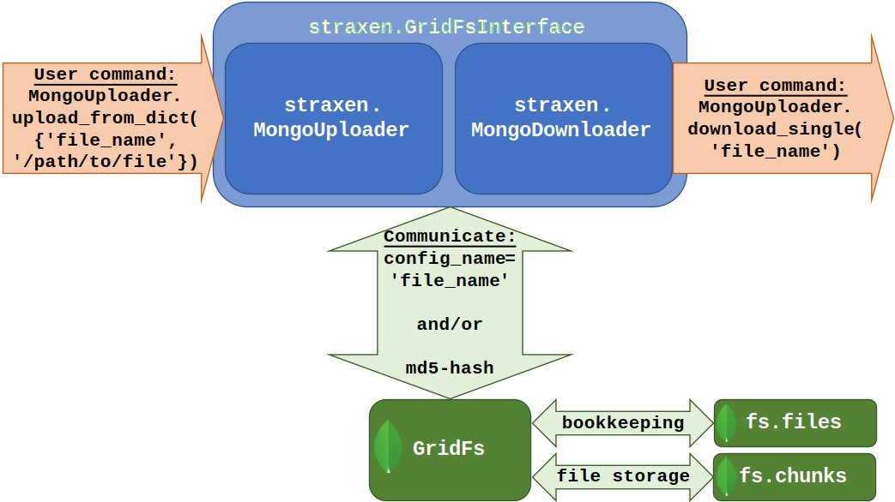

Storing configuration files in straxen
======================================

Most of the configuration files are stored in a mongo database that require a
password to access. Below the different methods of opening files such as
neural-nets in straxen are explained. Further down below a scheme is included
what is done behind the scenes.

Downloading XENONnT files from the database
-------------------------------------------
Most generically one downloads files using the :py:class:`utilix.mongo_storage.MongoDownloader`
function. For example, one can download a file:

.. code-block:: python

    import utilix
    downloader = utilix.mongo_storage.MongoDownloader()
    # The downloader allows one to download files from the mongo database by
    # looking for the requested name in the files database. The downloader
    #returns the path of the downloaded file.
    requested_file_name = 'fax_config.json'
    config_path = downloader.download_single(requested_file_name)
    # We can now open the file using get_resource
    simulation_config = straxen.get_resource(config_path, fmt='json')

Alternatively, one can rely on the loading of :py:func:`straxen.get_resource` as below:

.. code-block:: python

    import straxen
    simulation_config = straxen.get_resource(requested_file_name, fmt='json')

Downloading public placeholder files
------------------------------------
It is also possible to load any of our `placeholder files
<https://github.com/XENONnT/strax_auxiliary_files/>`_. This is
for example used for testing purposes of the software using continuous
integration. This can be done as per the example below. The advantage of
loading files in this manner is that it does not require any password.
However, this kind of access is restricted to very few files and there are
also no checks in place to make sure if the requested file is the latest file.
Therefore, this manner of loading data is intended only for testing purposes.

.. code-block:: python

    import straxen
    requested_url = (
        'https://github.com/XENONnT/strax_auxiliary_files/blob/'
        '3548132b55f81a43654dba5141366041e1daaf01/strax_files/fax_config.json')
    simulation_config = straxen.common.resource_from_url(requested_url, fmt='json')

How does the downloading work?
--------------------------------------
In :py:mod:`utilix/mongo_storage.py` there are two classes that take care of the
downloading and the uploading of files to the `files` database. In this
database we store configuration files under a :py:obj:`config_identifier` i.e. the
:py:obj:`'file_name'`. This is the label that is used to find the document one is
requesting.

Scheme
^^^^^^^^^
The scheme below illustrates how the different components work together to make
files available in the database to be loaded by a user. Starting on the left,
an admin user (with the credentials to upload files to the database) uploads a
file to the `files`- database (not shown) such that it can be downloaded later
by any user. The admin user can upload a file using the command
:py:obj:`MongoUploader.upload_from_dict({'file_name', '/path/to/file'})`.
This command will use the :py:class:`utilix.mongo_storage.MongoUploader` class to put the file
:py:obj:`'file_name'` in the `files` database. The :py:class:`utilix.mongo_storage.MongoUploader` will
communicate with the database via `GridFs
<https://docs.mongodb.com/manual/core/gridfs/>`_.
The GridFs interface communicates with two mongo-collections; :py:obj:`'fs.files'` and
:py:obj:`'fs.chunks'`, where the former is used for bookkeeping and the latter for
storing pieces of data (not to be confused with :py:class:`strax.Chunks`).

Uploading
^^^^^^^^^
When the admin user issues the command to upload the :py:obj:`'file_name'`-file.  The
:py:class:`utilix.mongo_storage.MongoUploader` will check that the file is not already stored in the
database. To this end, the :py:class:`utilix.mongo_storage.MongoUploader` computes the :py:obj:`md5-hash` of
the file stored under the :py:obj:`'/path/to/file'`. If this is the first time a file
with this :py:obj:`md5-hash` is uploaded, :py:class:`utilix.mongo_storage.MongoUploader` will upload it to
:py:obj:`GridFs`. If there is already an existing file with the :py:obj:`md5-hash`, there is no
need to upload. This however does mean that if there is already a file :py:obj:`'file_name'`
stored and you modify the :py:obj:`'file_name'`-file, it will be uploaded again! This is
a feature, not a bug. When a user requests the :py:obj:`'file_name'`-file, the
:py:class:`utilix.mongo_storage.MongoDownloader` will fetch the :py:obj:`'file_name'`-file that was uploaded
last.

Downloading
^^^^^^^^^^^
Assuming that an admin user uploaded the :py:obj:`'file_name'`-file, any user (no
required admin rights) can now download the :py:obj:`'file_name'`-file (see above for the
example). When the user executes :py:obj:`MongoUploader.download_single('file_name')`,
the :py:class:`utilix.mongo_storage.MongoDownloader` will check if the file is downloaded already. If
this is the case it will simply return the path of the file. Otherwise, it will
start downloading the file. It is important to notice that the files are saved
under their :py:obj:`md5-hash`-name. This means that wherever the files are stored,
it's unreadable what the file (or extension is). The reason to do it in this
way is that it will make sure that the file is never downloaded when it is
already stored but it would be if the file has been changed as explained above.

Straxen Mongo config loader classes
^^^^^^^^^^^^^^^^^^^^^^^^^^^^^^^^^^^
Both the :py:class:`utilix.mongo_storage.MongoUploader` and :py:class:`utilix.mongo_storage.MongoDownloader` share a common
parent class, the :py:class:`straxen.GridFsInterface` that provides the appropriate
shared functionality and connection to the database. The important difference
is the :py:obj:`readonly` argument that naturally has to be :py:obj:`False` for the
:py:class:`utilix.mongo_storage.MongoUploader` but :py:obj:`True` for the :py:class:`utilix.mongo_storage.MongoDownloader`.
