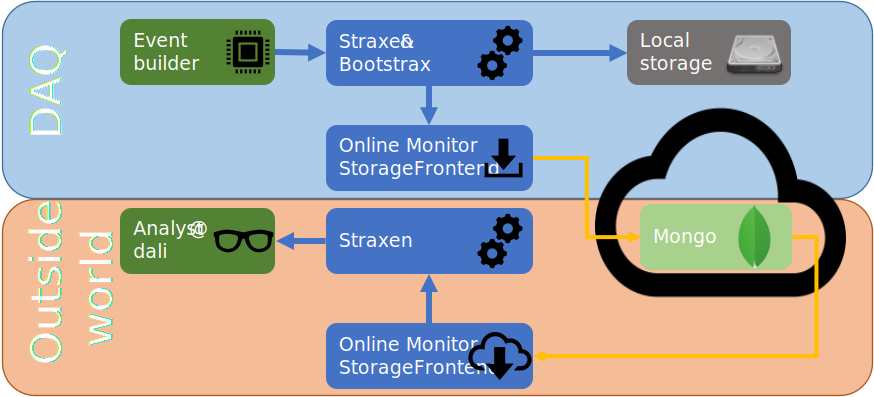

XENONnT online monitor
======================
Using strax, it is possible to live-process data while acquiring it.
This allows for fast monitoring. To further allow this, straxen has an
online monitor frontend. This allows a portion of the data to be
shipped of to the Mongo database while collecting the data at the DAQ.
This means that analysers can have fast feedback on what is going on inside the
TPC.

Loading data via the online monitor
-----------------------------------
In order to load this data in straxen, one can use the following setup
and start developing live-displays!

.. code-block:: python

    import straxen
    st = straxen.contexts.xenonnt_online(_add_online_monitor_frontend=True)

    # Allow unfinished runs to be loaded, even before the DAQ has finished processing this run!
    st.set_context_config({'allow_incomplete': True})
    st.get_df(latest_run_id, 'event_basics')

This command adds the online-monitor frontend to the context. If data is
now requested by the user strax will fetch the data via this frontend
if it is not available in any of the other storage frontends. Usually the data
is available within ~30 second after a pulse was detected by a PMT.

Machinery
---------
Using the strax online monitor frontend, each chunk of data being processed
on the DAQ can be shipped out to via the mongo database. Schematically,
this looks as in the following schematic. For data that is stored in the
online-monitor collection of the database, each chunk of data is stored twice.
The data that is written to the DAQ local storage is transferred by
`admix <https://github.com/XENONnT/admix>`_ to the shared analysis cluster
(`dali`). This transfer can only start once a run has been finished and also
the transfer takes time. To make data access almost instantaneous, this data is
also stored online.

The user will retrieve the data from the mongo database just as if the
data were stored locally. It takes slightly longer to store the data than if
it was stored on disk because each chunk is saved online individually.
However, with a decent internet connection, loading one run of any data
should only take ~10 s.

How long and what data is stored online?
----------------------------------------
The online storage cannot hold data for extended periods of time, and, since
data is shipped to the analysis sites, there is no need to keep it around
forever.
As such, data will be available up to 7 days after writing the data to the
database. After that, the online data will be deleted automatically.

Depending on the current settings, selected datatypes are stored in the database.
At the time of writing, these were:

  - ``online_peak_monitor``
  - ``event_basics``
  - ``veto_regions``

For the most up-to-date information, one can check the registration in the
``straxen.contexts.xenonnt_online`` context:
`here <https://github.com/XENONnT/straxen/blob/master/straxen/contexts.py#L160-L165>`_.

Caching the results of the online monitor
-----------------------------------------
For some applications, it's worth to keep a local copy of the data from the
online monitor. If one is interested in multiple runs, this is usually a good option.

To this end one can use the context function ``copy_to_frontend``. By setting
``rechunk=True``, we are combining the many small files (one per chunk) into
a few bigger files which makes it much faster to load next time.

.. code-block:: python

    import straxen
    st = straxen.contexts.xenonnt_online(_add_online_monitor_frontend=True)
    st.copy_to_frontend(latest_run_id, 'event_basics', rechunk=True)

One can look now where this run is stored:

.. code-block:: python

    for storage_frontend in st.storage:
        is_stored = st._is_stored_in_sf(latest_run_id, 'event_basics', storage_frontend)
        print(f'{storage_frontend.__class__.__name__} has a copy: {is_stored}')

which prints

.. code-block:: rst

    RunDB has a copy: False
    DataDirectory has a copy: False
    DataDirectory has a copy: False
    DataDirectory has a copy: True
    OnlineMonitor has a copy: True

You can also ``print(st.storage)`` to see which directories these refer to.
The ``DataDirectory``-storage frontends that do not have a copy are readonly
folders and not accessible to the user for writing.

For more information on this, checkout the
`strax documentation on copying data <https://strax.readthedocs.io/en/latest/advanced/recompression.html>`_.

Pre-configured monitoring tools
-------------------------------
For XENONnT we have the private monitor called  `olmo <https://github.com/XENONnT/olmo>`_
which is only visible for XENONnT members.

*Last updated 2021-05-07. Joran Angevaare*

