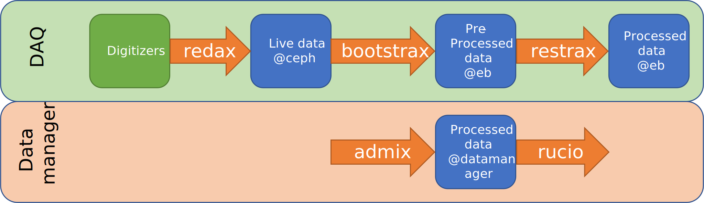

Straxen scripts
===================
Straxen comes with
`several scripts <https://github.com/XENONnT/straxen/tree/master/bin>`_
that allow common uses of straxen. Some of these scripts are designed
to run on the DAQ whereas others are for common use cases. Each of the
scripts will be briefly discussed below:

straxer
-------
``straxer`` is the most useful straxen script for regular users. Allows data to be
generated in a script format. Especially useful for reprocessing data
in batch jobs.

For example a user can reprocess the data of run ``012100`` using the
following command up to ``event_info_double``.

.. code-block:: bash

    straxer 012100 --target event_info_double

For more information on the options, please refer to the help:

.. code-block:: bash

    straxer --help

straxen-print_versions
----------------------
``straxen-print_versions`` is a small bin utility that wraps around ``straxen.print_versions``.
It allows one to quickly print which installation paths are used, such as for example:

.. code-block:: bash

    straxen-print_versions strax straxen cutax wfsim pema

ajax [DAQ-only]
----------------
The DAQ-cleaning script. Data is stored on the DAQ such that other tools
like `admix <https://github.com/XENONnT/admix>`_ may ship the data to
distributed storage. A portion of the high level data is stored on the DAQ
for diagnostic purposes for longer periods of time. ``ajax`` removes this
data if needed.
The ``ajax`` script looks for data on the eventbuilders
that can be deleted because at least one of the following reasons:

 - A run has been "abandoned", this means that there is no further use
   for this data, e.g. a board failed during a run, there is no point in
   keeping a run where part of the data on the DAQ.
 - The live-data (intermediate DAQ format, even more raw than raw-records) has
   been successfully processed. Therefore remove this intermediate datakind from
   daq.
 - A run has been abandoned but there is live-data still on the DAQ-bugger.
 - Data is "unregistered" (not in the runsdatabase),
   this only occurs if DAQ-experts perform tests on the DAQ.
 - Since bootstrax runs on multiple hosts, some of the data may appear to be
   stored more than once since a given bootstrax instance could crash during it's processing.
   The data of unsucessful processings should be removed by ``ajax``.
 - Finally ``ajax`` also checks if all the entries that are in the database are also on the host still
   This sanity check catches any potential issues in the data handling by admix.

restrax [DAQ-only]
--------------------
Bootstrax creates many files when processing the data live. To prevent aggregating too much
data in memory, it stores each datatype as soon as 200 MB (see ``strax.default_chunk_size_mb``)
of a datatype has been aggregated.
Furthermore, it does not rechunk the ``raw-records`` (i.e. just saves it as they come from redax).
This leads to **many small files**, which is an issue for the data-management, as each datatype may
create a single file every few seconds, and the data-management has to bookkeep all the seperate files.

``Restrax`` rechunks and recompresses the files after bootstrax is done with processing.
This means that the DAQ data flow is:

From left to right:
 - The digitizers readout the PMTs, and `redax https://github.com/AxFoundation/redax/>`_ reads
   from the digitizers. ``redax`` also converts the data (which we call ``live_data``) to a format
   that bootstrax can read. This data is stored to ``CEPH`` (see `<https://arxiv.org/abs/2212.11032>`_).
 - ``bootstrax`` reads the ``live_data`` from ``CEPH`` and processes it to the strax-datatypes
   (``raw_records``, ``peaks``, ``events``) and so on. Additionally, it fills the ``online_monitor`` collection
   with a selection of the data (see `the online monitor <https://straxen.readthedocs.io/en/latest/online_monitor.html>`_).
   All data is also written to a ``pre_processed`` directory. The data in the ``pre_processed`` directory
   is not yet considered by the data management tools.
 - The data is rechunked and recompressed by ``redax`` and stored in the production folder
   ``/data/xenonnt_processed``. We will elaborate on the rechunking and recompressing below.
 - Finally, the data is uploaded in the datamanagement tools by `admix <https://github.com/XENONnT/admix>`_
   which reads the data from the production folder and uploads it into ``rucio`` (our data management
   tool).

The first three steps are on the ``DAQ``, the last step is on ``datamanager`` which is
a server from the computing group that is also on the LNGS network.

**Rechunking & recompression**

Restrax does rechunking, which is the process of combining multiple blocks of data into one.
Additionally it recompresses the data, which is the storing of the data with heavier compression
algorithms. These take more CPU, but reduce the overall disksize of a given datatype, which is
especially useful for long-term storage.

**Why not have bootstrax do the rechunking/compression?**

In principle, ``bootstrax`` could also do the recompression and rechunking. However, there are
several issues with ``bootstrax`` doing this while also live-processing the data.
First of all, the memory usage would blow up massively if ``bootstrax`` would rechunk all
data types up to a chunk size of ~1000 MB, as it would buffer data for each data type up until that
chunk size, concatenate the data and than store it. If ~50 data types are stored, this
would give a memory consumption of up to 50x1000 MB = 50 GB. If you also account for the
concatenating (which doubles the memory consumption) you quicly allocate 100GB just for
saving data - not taking into account the requirements for the actual processing.

Additionally, for high rates, we do not always have the time for heavy compression algorithms, as
these take a lot of CPU. Doing those at a later time can assure we stay processing live while
still doing heavy compression later.

**Restrax philosophy**

Restrax is designed as a lazy algorithm, doing one thing at a time and only update the runs-database
after the job is done.
It does allow for parallelization, but this should be used with caution as it also increases the memory
footprint.
The maximum memory usage can be approximated by the 2x``target_size_mb`` from ``Restrax.get_compressor_and_size``
times the number of (raw-records) threads so ``4 * target_size_mb``, which usually
maxes out at 20GB for a raw-records target size of 5 GB.

bootstrax [DAQ-only]
--------------------
As the main DAQ processing script. This is discussed separately. It is only used for XENONnT.

fake_daq
------------------
Script that allows mimiming DAQ-processing by opening raw-records data.

microstrax
------------------
Mini strax interface that allows strax-data to be retrieved using HTTP requests
on a given port. This is at the time of writing used on the DAQ as a pulse viewer.

refresh_raw_records
-------------------
Updates raw-records from old strax versions. This data is of a different
format and needs to be refreshed before it can be opened with more recent
versions of strax.

*Last updated 2023-02-14. Joran Angevaare*
